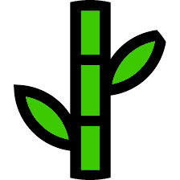

# bambuu
**Bambuu** TileMap Editor

## Features
- Quickly and easily create **tilemaps/levels** for **platformers, top-down shooters, etc**.
- Use your own **custom image files** for the tiles.
- **Save and load** tilemaps for iterative level design. 
- Up to 3 layers for a single tilemap file. (e.g. one layer for level, one layer for enemies, one layer for items)
- Up to 48 tiles (will add more later).
- Fill screen tool.
- Tilemaps don't have to be a square.

### Preview

## Tilemap File Data
Each tile is represented by a character.
Each row of the tilemap is delimited with a specified delimiter.
Each layer of the tilemap is delimited with a specified delimiter.

Example:
- 00000000
- 00110000
- 00222000
- 03333330

will be stored as
- 00000000.00110000.00222000.03333330 if the specified delimiter is **"."**

You can parse this string of data to translate them back into tiles in your own game.

Rows are delimited with **.** by default. You can customize this in the settings.

Layers are delimited with **/** by default. You can customize this in the settings. 

Example:

00000000001100000022200003333330 **/** 00000000001100000022200003333330 **/** 00000000001100000022200003333330

### How to Use Bambuu

### Saving and Loading Tile Maps
Choose where to save your tilemap.

Add the extension **.bbuu** to the file name of your tilemap. 
Add the extension **.txt** if you want a regular text file instead.

### Customizing Settings
You can customize the background color of the editor.

You must specify the size of your custom tiles (default is 64x64).

### Features to add in the Future:
- being able to make square tilemaps without use of row delimiter.
- "undo" function
